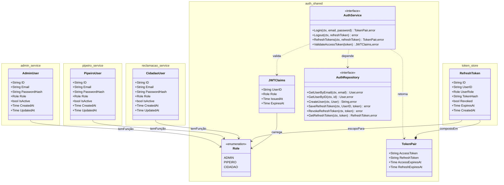

```mermaid
classDiagram
  namespace auth_shared {
    class Role {
      <<enumeration>>
      ADMIN
      PIPEIRO
      CIDADAO
    }

    class TokenPair {
      +String AccessToken
      +String RefreshToken
      +Time AccessExpiresAt
      +Time RefreshExpiresAt
    }

    class JWTClaims {
      +String UserID
      +Role Role
      +Time IssuedAt
      +Time ExpiresAt
    }

    class AuthRepository {
      <<interface>>
      +GetUserByEmail(ctx, email) User,error
      +GetUserByID(ctx, id) User,error
      +CreateUser(ctx, User) String,error
      +SaveRefreshToken(ctx, UserID, token) error
      +RevokeRefreshToken(ctx, token) error
      +GetRefreshToken(ctx, token) RefreshToken,error
    }

    class AuthService {
      <<interface>>
      +Login(ctx, email, password) TokenPair,error
      +Logout(ctx, refreshToken) error
      +RefreshTokens(ctx, refreshToken) TokenPair,error
      +ValidateAccessToken(token) JWTClaims,error
    }
  }

  namespace admin_service {
    class AdminUser {
      +String ID
      +String Email
      +String PasswordHash
      +Role Role
      +bool IsActive
      +Time CreatedAt
      +Time UpdatedAt
    }
  }

  namespace pipeiro_service {
    class PipeiroUser {
      +String ID
      +String Email
      +String PasswordHash
      +Role Role
      +bool IsActive
      +Time CreatedAt
      +Time UpdatedAt
    }
  }

  namespace reclamacao_service {
    class CidadaoUser {
      +String ID
      +String Email
      +String PasswordHash
      +Role Role
      +bool IsActive
      +Time CreatedAt
      +Time UpdatedAt
    }
  }

  namespace token_store {
    class RefreshToken {
      +String ID
      +String UserID
      +Role UserRole
      +String TokenHash
      +bool Revoked
      +Time ExpiresAt
      +Time CreatedAt
    }
  }

  AdminUser --> Role : temFunção
  PipeiroUser --> Role : temFunção
  CidadaoUser --> Role : temFunção
  RefreshToken --> Role : escopoPara

  AuthService ..> TokenPair : retorna
  AuthService ..> JWTClaims : valida
  AuthService ..> AuthRepository : depende
  JWTClaims --> Role : carrega
  RefreshToken --* TokenPair : compostoEm
```

