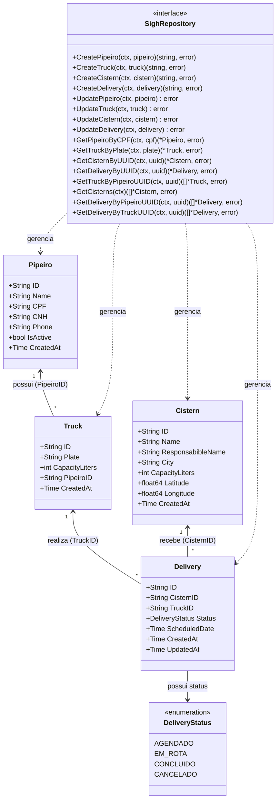

```mermaid
classDiagram
    %% Enumeração de Status
    class DeliveryStatus {
        <<enumeration>>
        AGENDADO
        EM_ROTA
        CONCLUIDO
        CANCELADO
    }

    %% Entidades de Domínio
    class Pipeiro {
        +String ID
        +String Name
        +String CPF
        +String CNH
        +String Phone
        +bool IsActive
        +Time CreatedAt
    }

    class Truck {
        +String ID
        +String Plate
        +int CapacityLiters
        +String PipeiroID
        +Time CreatedAt
    }

    class Cistern {
        +String ID
        +String Name
        +String ResponsabibleName
        +String City
        +int CapacityLiters
        +float64 Latitude
        +float64 Longitude
        +Time CreatedAt
    }

    class Delivery {
        +String ID
        +String CisternID
        +String TruckID
        +DeliveryStatus Status
        +Time ScheduledDate
        +Time CreatedAt
        +Time UpdatedAt
    }

    %% Interface do Repositório
    class SighRepository {
        <<interface>>
        +CreatePipeiro(ctx, pipeiro) (string, error)
        +CreateTruck(ctx, truck) (string, error)
        +CreateCistern(ctx, cistern) (string, error)
        +CreateDelivery(ctx, delivery) (string, error)
        +UpdatePipeiro(ctx, pipeiro) error
        +UpdateTruck(ctx, truck) error
        +UpdateCistern(ctx, cistern) error
        +UpdateDelivery(ctx, delivery) error
        +GetPipeiroByCPF(ctx, cpf) (*Pipeiro, error)
        +GetTruckByPlate(ctx, plate) (*Truck, error)
        +GetCisternByUUID(ctx, uuid) (*Cistern, error)
        +GetDeliveryByUUID(ctx, uuid) (*Delivery, error)
        +GetTruckByPipeiroUUID(ctx, uuid) ([]*Truck, error)
        +GetCisterns(ctx) ([]*Cistern, error)
        +GetDeliveryByPipeiroUUID(ctx, uuid) ([]*Delivery, error)
        +GetDeliveryByTruckUUID(ctx, uuid) ([]*Delivery, error)
    }

    %% Relacionamentos
    Pipeiro "1" <-- "*" Truck : possui (PipeiroID)
    Truck "1" <-- "*" Delivery : realiza (TruckID)
    Cistern "1" <-- "*" Delivery : recebe (CisternID)
    Delivery --> DeliveryStatus : possui status
    
    %% Dependências da Interface
    SighRepository ..> Pipeiro : gerencia
    SighRepository ..> Truck : gerencia
    SighRepository ..> Cistern : gerencia
    SighRepository ..> Delivery : gerencia
```